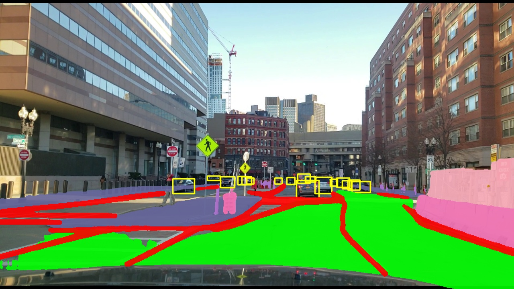

# CMU-18744-AV

Course project for **CMU 18-744: Autonomous Driving**.

This repository provides demo pipelines for:

- **YOLOPv2** for object detection, drivable area segmentation, and lane line segmentation
- **DeepLabV3** for workzone semantic segmentation
- A **merged visualization** that combines outputs from both models

---

## 1. Setup

### 1.1 Environment Setup

Please install the required dependencies by referring to the [YOLOPv2 requirements](https://github.com/CAIC-AD/YOLOPv2/blob/main/requirements.txt).

### 1.2 Download Model Weights

#### YOLOPv2
Download the pretrained YOLOPv2 weights from [here](https://github.com/CAIC-AD/YOLOPv2/releases/download/V0.0.1/yolopv2.pt).

Place the file in: `./YOLOPv2/weights/`

#### DeepLabV3 (ROADWork)
Download the pretrained DeepLabV3 weights for ROADWork from [here](https://drive.google.com/file/d/1FbmIt24FfGu4kKMMp-IZUqS-jHt3Rshx/view).

Place the weight file in `./DeeplabV3/weights/sem_segm_gps_split/`


### 1.3 Dataset Preparation

All datasets and source images/videos are placed in `./Datasets/...`

#### ROADwork

Download the required files from [this link](https://kilthub.cmu.edu/articles/dataset/ROADWork_Data/26093197), including:

- `images.zip`
- `annotations.zip`
- `sem_seg_labels.zip`
- `video_compressed.z01`

#### BDD100K

Download the required files from [this link](http://bdd-data.berkeley.edu/download.html), including:

- `10K images`
- `video/bdd100k_videos_train_00.zip `

#### Data Organization

Then organize the dataset in the following structure:

```text
Datasets
├── ROADwork
│   ├── images/
│   ├── annotations/
│   ├── sem_seg_labels/
│   └── videos/
└── BDD100K
    ├── 10K/
    │   ├── train/
    │   ├── val/
    │   └── test/
    └── video/
```


## 2. Run Demos

### 2.1 YOLOPv2 and DeepLabV3+ Demo
Run YOLOPv2 demo:
```bash
python Demo_YOLOPV2.py --source "*.jpg"
```

Run DeepLabV3 demo:
```bash
python Demo_DeeplabV3.py --source "*.jpg"
```

Run the merged demo for both YOLOPv2 and DeepLabV3:
```bash
python Demo_merged.py --source "*.jpg"
```

### All-in-one Demo

For nuScenes
```bash
python demo_all_nusc.py
```

For BDD100K and ROADwork:
```bash
python demo_all_BDD_ROADwork.py --dataset <BDD100K|ROADwork> --source <path_to_image_or_video_or_directory>
```
-- `dataset`: choose from BDD100K or ROADwork
-- `source`: supports a single image, a single video, or a directory containing images and videos

#### Output

Visualization image is saved into `./output/(YOLOPv2/DeeplabV3/merged)`


One Demo
